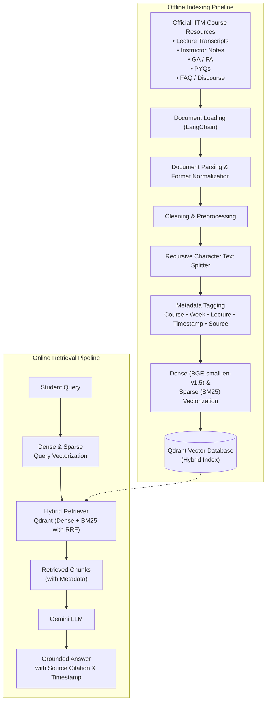

DS&AI Lab Project [Term May 2026]

# Course-Aware Personalized Learning Companion for IIT Madras BS Degree Students
## MILESTONE-2: Dataset Identification & Preparation

Indian Institute of Technology Madras
GROUP: 3

| Name | Student Roll No. | GitHub User ID |
|---|---|---|
| Mayank Singh | 23f1000598 | Mayank8IITM |
| Ali Jawad | 22f3001825 | 22f3001825 |
| Sachi Dhaturaha | 21f1000471 | 21f1000471 |
| Aryan Pratap Maurya | 22f1000559 | AryanPratap455 |
| Jibin V Mathews | 21f1001895 | 21f1001895 |

---

## 1. Introduction & Objectives

The objective of Milestone-2 is to identify, evaluate, and prepare the knowledge base required to power a Retrieval-Augmented Generation (RAG) assistant for the **CS2007 – Machine Learning Techniques (MLT)** course. The system is intended to answer student queries — conceptual doubts, PYQ-style questions, and clarifications on weekly content — by retrieving grounded context from official course material and generating a natural-language answer via an LLM (Gemini/Groq).

The dataset underpinning this system supports three tightly coupled sub-tasks:
- **Document Ingestion & Chunking** – converting heterogeneous course resources into retrieval-ready text chunks.
- **Hybrid Retrieval** – combining Dense Retrieval (BGE-small embeddings) and Sparse Retrieval (BM25 exact keyword matching) using Qdrant's native Hybrid Search with Reciprocal Rank Fusion (RRF).
- **Answer Generation** – conditioning an LLM (Gemini/Groq) on retrieved context to produce a grounded, course-accurate response.

The goal of this milestone is to ensure the knowledge base is:
- Clearly sourced, with ownership and usage rights verified
- Well-structured and described (volume, format, distribution across weeks/types)
- Assessed for quality issues (noise, duplication, missing/garbled content)
- Adequate in coverage, with a plan for augmentation where gaps exist
- Split appropriately for retrieval/generation evaluation without leakage
- Processed through a documented, reproducible pipeline

### 1.1 Scope & Assumptions

| In-Scope | Out-of-Scope |
|---|---|
| CS2007 MLT weekly content (Transcripts, Notes, PYQ, AQ/PQ, External Notes, FAQ) | Other course materials outside CS2007 |
| Text-based retrieval and QA | Video retrieval |
| Course-term-specific PYQs and FAQs currently published | Real-time forum discussion threads (dynamic, unverified content) |
| Hybrid retrieval (Dense via sentence-transformers + Sparse via BM25) | Fine-tuning the base LLM (Gemini/Groq used only via inference/API) |
| Fusion/Reranking of retrieved passages via RRF |  -|

---

## 2. Data Source Identification & Verification

### 2.1 Primary Sources

| Source | Description | Owner/Platform | Access Format |
|---|---|---|---|
| Discourse Weekly Resources Thread | Official weekly resource index for CS2007 | IITM Online Degree Discourse | HTML forum posts, embedded links/attachments |
| Karthik Sir Notes | Instructor-maintained static site with structured weekly notes | Course faculty (Karthik) — GitHub Pages | Static HTML/Markdown |
| Transcripts | Lecture video transcripts, week-wise | Course platform / instructor | Text (VTT/plain text) |
| PYQ | Past end-term/quiz question papers | IITM Academic Office / course archives | PDF |
| AQ/PQ (week-wise) | Weekly graded and practice questions | Course platform | HTML/PDF |
| External Notes | Community/TA-contributed supplementary notes | Student contributors | Markdown/PDF |
| FAQ | Frequently asked doubts and instructor/TA responses | Discourse threads, curated FAQ page | HTML |

### 2.2 Ownership & Usage Constraints

- All content originates from IITM's official course delivery platforms (Discourse, GitHub Pages hosted by course staff). It is accessed as an enrolled student for internal academic project use (this DS&AI Lab submission), not for redistribution or commercial use.
- No content is scraped from paywalled, third-party, or unauthorized sources.
- PYQs are institute-released academic archives; used strictly for retrieval-context construction, not for public re-publication.
- Any supplementary open-source material used for augmentation (Section 5.2) will be cited with source and license explicitly.

---

## 3. Dataset Description

### 3.1 Composition by Content Type

> The table below contains the actual, audited counts obtained after completing the corpus scrape and inventory.

| Content Type | Count | Format | Notes |
|---|---|---|---|
| Lecture Transcripts | 75 | Plain text | Verbatim speech-to-text, requires cleanup |
| Instructor Notes | 14 | Markdown/PDF | To be audited for structure/noise |
| PYQ | 12 | PDF | Some papers may require OCR — to be confirmed per file |
| AQ/PQ (week-wise) | 23 | HTML/PDF | Presence of solutions to be logged per week |
| External Notes | 23 | Markdown/PDF | Heterogeneous formatting — to be catalogued |
| FAQ | 12 | HTML | Count of unique (non-duplicate) Q&A pairs to be logged after dedup |

### 3.2 Distribution Across Weeks

The original claim that "later weeks have denser FAQ/PYQ activity due to exam proximity, while early weeks are richer in foundational notes" was a **hypothesis**, not a measured fact. This will be confirmed or revised once the per-week document/word counts are tabulated (Section 3.1). The actual per-week distribution (e.g., a bar chart of document count and token count per week, per source type) will be added here once computed, and will directly inform the coverage gap analysis in Section 5.

### 3.3 Feature/Field Schema (post-ingestion)

Each document, after preprocessing, is represented with the following metadata schema. This has been corrected from the draft version (which had a duplicated `"Timestamp start"` key and lacked several fields needed for citation/traceability):

```json
{
  "doc_id": "week03_notes_002",
  "chunk_id": "week03_notes_002_c1",
  "source_type": "notes | transcript | pyq | aq_pq | external | faq",
  "week": 3,
  "lecture_number": 3.2,
  "title": "Bias-Variance Tradeoff",
  "page_number": null,
  "timestamp_start": "00:00",
  "timestamp_end": "01:00",
  "author": "instructor | ta | student_contributor",
  "raw_text": "...",
  "chunk_text": "...",
  "chunk_index": 1,
  "total_chunks_in_doc": 4,
  "url": "https://karthik-iitm.github.io/MLT/week3#bias-variance",
  "token_count": 187,
  "language": "en",
  "confidence_flag": "verified | low_confidence"
}
```

Field notes:
- `lecture_number` and `page_number` are populated where applicable (lecture_number for transcripts, page_number for PDF-sourced PYQ/notes); left `null` when not relevant to the source type.
- `confidence_flag` is used specifically to mark FAQ/external-note content that has not been cross-checked against instructor material (see Section 4).

---

## 4. Data Quality Assessment


| Issue | Observation / Status | Mitigation |
|---|---|---|
| Missing values | To be logged per source_type/week once corpus is scraped (e.g., weeks with zero External Notes) | Documented as coverage gaps rather than imputed; flagged for augmentation (Sec. 5) |
| Duplicates | Exact count of near-duplicate FAQ/Discourse entries to be measured after running embedding-based similarity check | Near-duplicate detection via cosine similarity on embeddings; duplicates merged, keeping the most complete answer |
| Noise | Transcripts are expected to contain filler words, timestamps, and speaker artifacts (e.g., "um", "so yeah", `[00:03:12]`) — to be confirmed by sampling a subset of transcripts | Regex-based cleanup + sentence-boundary re-segmentation |
| Formatting inconsistency | Notes are known to mix Markdown, LaTeX math, and inline HTML; PYQs are PDF/scanned — extent to be confirmed by file audit | Unified conversion to plain text with LaTeX preserved via delimiters (`$...$`); OCR (Tesseract) for scanned PYQs |
| Broken/stale links | Number of 404s from Discourse-linked resources to be logged during scraping | Logged and excluded from ingestion; does not block pipeline |
| Answer correctness (FAQ) | Some FAQ answers are informal TA replies that may not be verified against notes — extent to be assessed manually on a sample | Cross-checked against instructor notes before inclusion in the trusted retrieval index; unverified entries tagged `low_confidence` |

### 4.1 Near-duplicate detection threshold

- The threshold will **not** be hard-coded a priori. It will be **determined experimentally** by manually labeling a sample of ~100–150 candidate pairs (spanning FAQ, Discourse, and External Notes) as duplicate/non-duplicate, and selecting the threshold that maximizes F1 on this labeled sample.
- As a reference starting point, sentence-embedding literature (e.g., Sentence-BERT / SimCSE semantic textual similarity benchmarks) commonly treats cosine similarity above ~0.85–0.90 as indicating high semantic overlap; this range will be used only as an initial search window, not as the final value.
- The final chosen threshold, along with the observed precision/recall trade-off, will be documented once the corpus audit and threshold-tuning experiments are complete.

---

## 5. Adequacy Evaluation & Augmentation Strategy

### 5.1 Coverage Gaps (Expected — to be confirmed by data)
- Weeks with sparse External Notes and no PYQ history (e.g., a newly introduced topic) are expected to leave thin retrieval context — to be confirmed once per-week document counts (Section 3.1) are available.
- FAQ coverage is expected to skew toward assignment-deadline-driven doubts rather than conceptual depth — to be confirmed by categorizing a sample of FAQ questions.

### 5.2 Augmentation Plan
- **Supplementary retrieval-only sources:** For weeks identified as thin, we will supplement with instructor slide PDFs (if available) or sections from an established open textbook (e.g., *An Introduction to Statistical Learning*). These will be used **only as retrieval context**, cited transparently with source/license, and never presented as original course content.
- **Synthetic Q&A generation for retrieval evaluation only (not for the knowledge base or training):**
  - **Purpose:** to build a query set for measuring retrieval Recall@k/Precision@k (Section 7.5), not to expand the retrieval index.
  - **Volume (planned):** approximately 5–10 synthetic questions per week across all 12 weeks — exact count to be finalized once per-week source chunk counts are known.
  - **Generation method:** an LLM (Gemini/Groq) will be prompted with a source chunk and asked to generate a student-style question whose answer is fully contained in that chunk; the chunk is stored as the gold passage for that query.
  - **Quality control:** a random subset of generated questions will be manually reviewed by the team for relevance and naturalness before being added to the evaluation set.
  - No fabricated course content is ever injected into the retrieval index — augmentation only expands retrieval-evaluation queries or supplements external, clearly-cited context.

---

## 6. Train / Validation / Test Split Strategy

Because this is a RAG system rather than a supervised classifier, "splits" apply at two levels.

### 6.1 Retrieval Evaluation Split
- **Query set:** Synthetic + real FAQ questions will be split **by week/topic, not randomly by row**, to prevent leakage — i.e., all chunks from a given week and all queries derived from that week are grouped together and assigned entirely to one split.
- **Split ratio (proposed):** 70% train (index-building/tuning) / 15% validation (chunk-size, top-k tuning, duplicate-threshold tuning) / 15% test (final retrieval recall/precision reporting). This ratio is a starting proposal and may be adjusted once actual week/query counts are known.
- **Leakage check (planned):** we will programmatically verify that no chunk appearing in a validation/test query's gold context also appears (verbatim, or near-duplicate above the threshold determined in Section 4.1) in the training-time index-tuning set. Results of this check will be reported, not assumed.

### 6.2 Generation Evaluation Split
- A held-out set of representative student queries covering all 12 weeks will be reserved purely for end-to-end answer-quality evaluation — never used during chunking/embedding-parameter tuning. Proposed size: 50 queries (~4 per week), to be confirmed once per-week chunk counts are available.

### 6.3 Why Topic-Wise (not Random) Splitting
Random row-level splitting on chunks would risk placing two chunks from the same paragraph into train and test respectively, artificially inflating retrieval scores. Splitting by week/topic ensures the evaluation set genuinely tests generalization to unseen content structure.

---

## 7. RAG-Specific Pipeline: Chunking, Embedding, and Vector Store

### 7.1 Document Preparation
- **Format normalization:** PDF → text (PyMuPDF/pdfplumber), OCR fallback (Tesseract) for scanned PYQs, HTML → text (BeautifulSoup) for Discourse/FAQ pages, Markdown parsed directly for Notes.
- **Cleaning:** removal of navigation boilerplate, timestamps, HTML tags, duplicate headers/footers, filler words in transcripts.
- **Metadata tagging:** each document tagged with `source_type`, `week`, `lecture_number`/`page_number`, `title`, `url`, `author` for citation and filtering at query time (see schema in Section 3.3).
- **Orchestration:** document loading, splitting, and the retrieval chain will be implemented using **LangChain** (`DocumentLoader`, `RecursiveCharacterTextSplitter`, and a retriever wrapper around the Qdrant hybrid index), to keep the pipeline modular.

### 7.2 Chunking Strategy

| Parameter | Baseline Value | Rationale |
|---|---|---|
| Chunk size | **384 tokens** | `BGE-small` has a strict maximum context length of 512 tokens. 384 tokens safely fits within this limit while capturing 1-2 paragraphs of text (a natural semantic unit). |
| Overlap | **15% (≈58 tokens)** | Standard industry practice (10-20%). Ensures sentences spanning boundaries aren't orphaned, preventing context loss without bloating the index. |
| Strategy | Semantic/Recursive | Implemented via LangChain's `RecursiveCharacterTextSplitter` using heading/paragraph separators. This respects the natural structure of transcripts and notes rather than cutting arbitrarily mid-sentence. |
| Special handling | Atomic Q&A | FAQ/PYQ/AQ-PQ are kept as one chunk per Question+Solution. Splitting a question from its answer would destroy the retrievable context. |

*Note: These values (384 tokens / 15% overlap) serve as our **baseline configuration** based on standard RAG best practices. During the validation phase (Section 6.1), we will run experiments comparing chunk sizes of 256, 384, and 512 tokens to empirically determine which yields the best Recall@k, and the tuned configuration will be adopted for the final system.*

### 7.3 Embedding Model

**Chosen: BGE-small (BAAI/bge-small-en), 384-dim output.**

Justification relative to alternatives considered:

| Model | Dim | Notes |
|---|---|---|
| **BGE-small (chosen)** | 384 | Strong retrieval performance on the MTEB retrieval benchmark relative to its size; small enough for CPU/low-resource inference during development; open-weight, no API cost or rate limits |
| OpenAI `text-embedding-3-small` | 1536 | Competitive quality but requires a paid API call per chunk/query, adding cost and external dependency for a student project |
| `e5-small-v2` | 384 | Comparable size/performance to BGE-small; considered as a close alternative — BGE-small was preferred for its slightly stronger public MTEB retrieval scores and wider community adoption at the time of selection |
| `gte-small` | 384 | Similar profile to BGE-small; not chosen due to less familiarity within the team and comparable benchmark performance |

We selected BGE-small primarily for the combination of **(a)** no external API dependency/cost, **(b)** small footprint suitable for local/CPU development, and **(c)** strong out-of-the-box MTEB retrieval performance without requiring fine-tuning.

### 7.4 Vector Database: FAISS vs. Qdrant

| Criterion | FAISS | Qdrant |
|---|---|---|
| Deployment | In-process, library-only, no server | Client-server or local file mode, supports filtering by metadata natively |
| Metadata filtering | Requires manual pre/post-filtering | Native payload filtering (e.g., restrict retrieval to a given week) |
| Persistence | Manual index save/load | Built-in persistence, easier for iterative dev |
| Best fit for this project | Fast prototyping, simple vector-only search | Course-aware retrieval requiring strict metadata filtering |

**Decision: Qdrant.** We have selected Qdrant as our primary vector database. Given our extensive metadata schema (Section 3.3), the ability to perform **native payload filtering** is critical. If a student's query implies a specific scope (e.g., "Show me week 4 PYQs"), Qdrant allows us to strictly filter the search space by `week=4` and `source_type=pyq` *before* top-k retrieval, maintaining the integrity of our retrieval math. Additionally, Qdrant natively supports **Hybrid Search (Dense + Sparse via BM25)** with Reciprocal Rank Fusion (RRF), eliminating the need for a separate sparse search index. Furthermore, Qdrant's local Python client allows for simple, file-based persistence without the overhead of running a Docker server during development.

### 7.5 Evaluation Metrics 

To avoid the earlier draft's vagueness, evaluation is defined explicitly:

**Retrieval evaluation** (on the held-out query set from Section 6.1, using the Hybrid Search RRF rankings), computed at **k = 5**:
- **Recall@5** – fraction of queries for which the gold chunk appears in the top-5 retrieved chunks.
- **Precision@5** – fraction of the top-5 retrieved chunks that are relevant to the query.
- **MRR (Mean Reciprocal Rank)** – rewards ranking the gold chunk higher within the top-k.

k = 5 is chosen as a starting point representative of how many passages would realistically be passed to the LLM as context; k = 10 will additionally be reported as a secondary metric to observe recall saturation.

**Generation evaluation** (on the held-out query set from Section 6.2), using the RAGAS framework or an equivalent LLM-judge protocol:
- **Faithfulness** – whether the generated answer is supported by the retrieved context (no hallucinated claims).
- **Answer Relevance** – whether the generated answer actually addresses the student's question.
- **Context Precision/Recall** – whether the retrieved context was necessary and sufficient for the answer.

### 7.6 Advanced Retrieval (Hybrid Search)

Instead of relying on a slow, computationally expensive Cross-Encoder for reranking, we will implement **Hybrid Search** leveraging Qdrant's native capabilities. 
- **Mechanism:** We will combine **Dense Search** (semantic meaning via BGE-small) with **Sparse Search** (exact keyword matching via BM25). 
- **Fusion:** The results from both search methods will be combined using Reciprocal Rank Fusion (RRF). 
- **Rationale:** In a technical course like MLT, exact keyword matches (e.g., specific variable names or acronyms like "PCA") are just as important as semantic meaning. Hybrid search gives us the high precision of a reranker without the severe latency penalty of running a local Cross-Encoder.

### 7.7 Retrieval–Generation Alignment
- Retrieved chunks (ranked via RRF) are passed to the LLM with explicit source metadata (week, source type) so the generated answer can cite its source — important for student trust in a study-assistant tool.
- A consistent chunk-ID scheme ties retrieval results directly back to the original document location, enabling traceability from generated answer → chunk → source document.

---

## 8. Preprocessing Pipeline (Reproducibility)

### 8.1 Pipeline Steps

**Offline Indexing Pipeline:**
1. **Document Loading (LangChain)** → Load official IITM course resources (Transcripts, Instructor Notes, GA/PA, PYQs, FAQ/Discourse).
2. **Document Parsing & Format Normalization** → Route to PDF (PyMuPDF/pdfplumber, Tesseract OCR fallback) / HTML (BeautifulSoup) / Markdown (direct parse) / transcript (VTT/plain-text parser).
3. **Cleaning & Preprocessing:**
   - HTML: strip navigation boilerplate, scripts/styles, ad/footer blocks.
   - Transcripts: regex removal of timestamps (e.g., `[00:03:12]`) and filler words ("um", "so yeah"); sentence-boundary re-segmentation.
   - Notes: normalize Markdown/LaTeX/inline-HTML mix into plain text with LaTeX preserved via `$...$` delimiters.
   - Deduplication: embedding-based cosine-similarity near-duplicate detection.
4. **Chunking** → LangChain `RecursiveCharacterTextSplitter`, 384 tokens / 15% overlap (Section 7.2); 1 chunk = 1 Q&A for FAQ/PYQ/AQ-PQ.
5. **Metadata Tagging** → Tag each chunk with Course, Week, Lecture, Timestamp, and Source (schema in Section 3.3).
6. **Embedding & Sparse Vectorization** → Dense embeddings via `BGE-small-en-v1.5` (384-dim) and Sparse vectors via BM25.
7. **Indexing** → Store dense embeddings, sparse vectors, and metadata into the `Qdrant` vector database (Hybrid Index).

**Online Retrieval Pipeline:**

8. **Query Vectorization** → Student query is converted into a Dense embedding (`BGE-small-en-v1.5`) and a Sparse vector (BM25).
9. **Hybrid Retrieval** → Qdrant native Hybrid Search retrieves most relevant chunks using Reciprocal Rank Fusion (RRF) on dense and sparse results.
10. **LLM Generation** → Gemini LLM generates a grounded answer with source citation and timestamp.
11. **Evaluate** → Topic-wise train/val/test split (Section 6), Recall@k/Precision@k/MRR on held-out queries (Section 7.5).

All scripts are version-controlled on the group GitHub repository, with raw scraped data, cleaned text, and final chunk/embedding artifacts stored in separate pipeline stages to keep preprocessing fully reproducible.

### 8.2 Pipeline / Architecture Diagram



---

## 9. Summary of Milestone 2

We have identified and verified CS2007's official weekly resources (Transcripts, Notes, PYQ, AQ/PQ, External Notes, FAQ), defined a data-quality and adequacy assessment plan, and designed a topic-aware chunking → Dense (BGE-small) + Sparse (BM25) vectorization → Qdrant Hybrid Search (RRF) pipeline with LangChain orchestration. Several quantities in this milestone (exact document/word counts, per-week distribution, final duplicate threshold, final synthetic-query count) are **explicitly marked as pending actual measurement** rather than assumed, and will be finalized before/alongside the Milestone 3 submission once the corpus audit and threshold-tuning experiments are complete. This establishes a reproducible, leakage-checked foundation for the RAG-based learning assistant, feeding into end-to-end retrieval + generation evaluation in Milestone 3.
