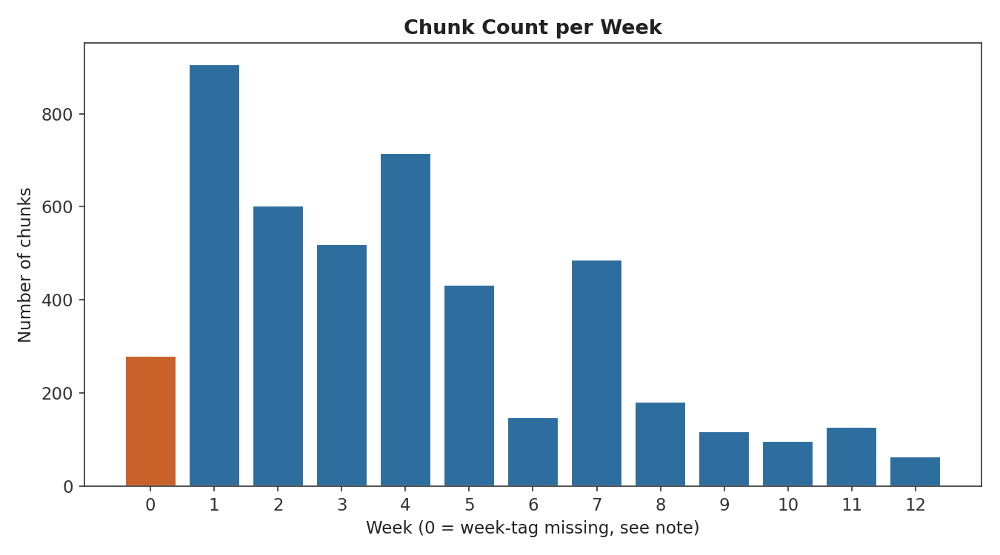
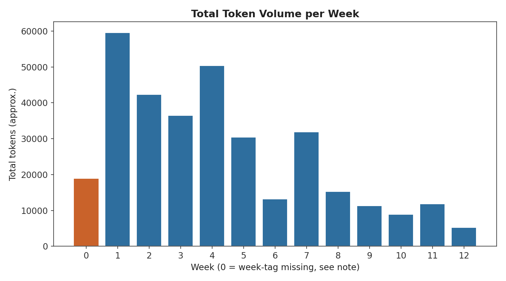
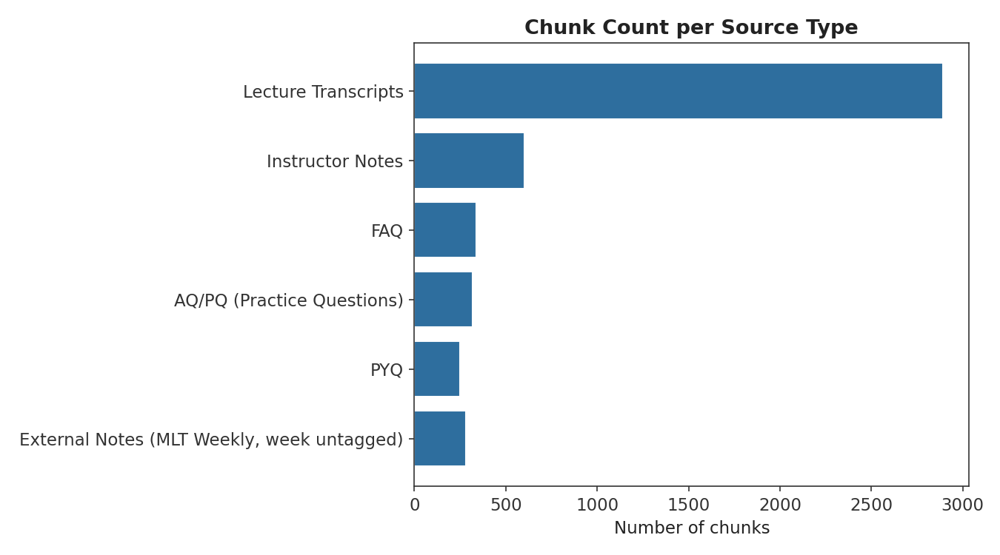
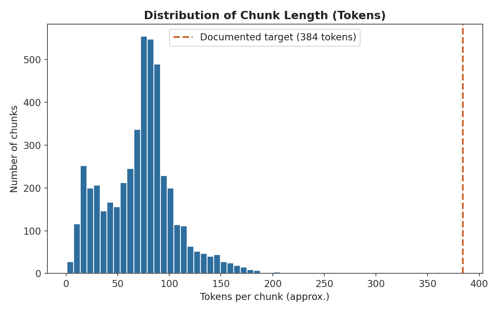
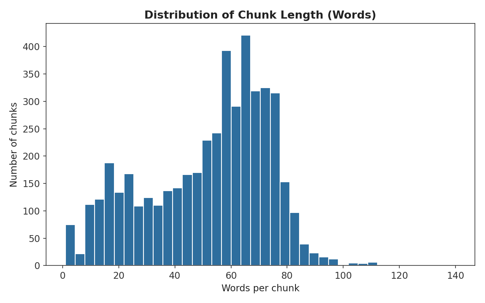
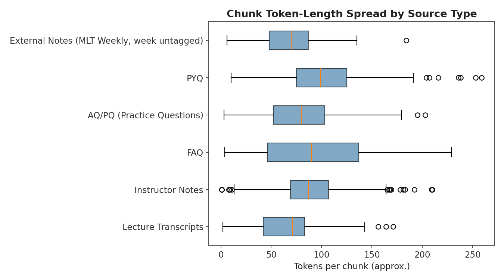
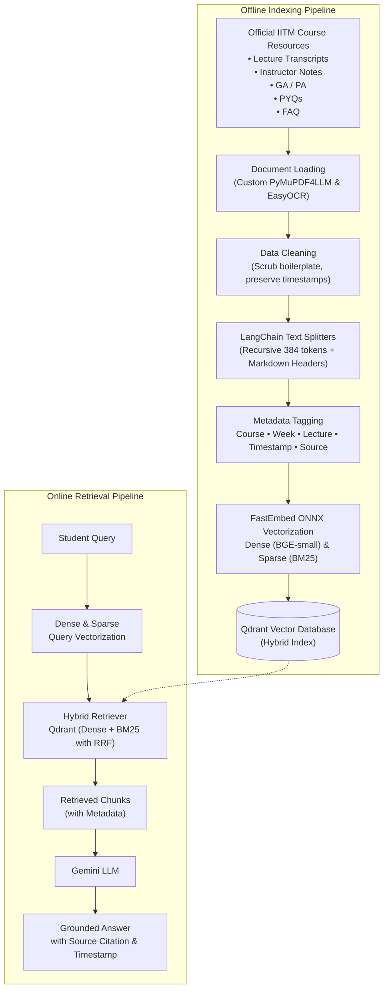

DS&AI Lab Project [Term May 2026]

# Course-Aware Personalized Learning Companion for IIT Madras BS Degree Students
## MILESTONE-2: Dataset Identification & Preparation

Indian Institute of Technology Madras
GROUP: 3

| Name | Student Roll No. | GitHub User ID |
|---|---|---|
| Mayank Singh | 23f1000598 | Mayank8IITM |
| Ali Jawad | 22f3001825 | 22f3001825 |
| Sachi Dhaturaha | 21f1000471 | 21f1000471 |
| Aryan Pratap Maurya | 22f1000559 | AryanPratap455 |
| Jibin V Mathews | 21f1001895 | 21f1001895 |

---

## 1. Introduction & Objectives

The objective of Milestone-2 is to identify, evaluate, and prepare the knowledge base required to power a Retrieval-Augmented Generation (RAG) assistant for the **CS2007 – Machine Learning Techniques (MLT)** course. The system is intended to answer student queries — conceptual doubts, PYQ-style questions, and clarifications on weekly content — by retrieving grounded context from official course material and generating a natural-language answer via an LLM (Gemini/Groq).

The dataset underpinning this system supports three tightly coupled sub-tasks:
- **Document Ingestion & Chunking** – converting heterogeneous course resources into retrieval-ready text chunks.
- **Hybrid Retrieval** – combining Dense Retrieval (BGE-small embeddings) and Sparse Retrieval (BM25 exact keyword matching) using Qdrant's native Hybrid Search with Reciprocal Rank Fusion (RRF).
- **Answer Generation** – conditioning an LLM (Gemini/Groq) on retrieved context to produce a grounded, course-accurate response.

The goal of this milestone is to ensure the knowledge base is:
- Clearly sourced, with ownership and usage rights verified
- Well-structured and described (volume, format, distribution across weeks/types)
- Assessed for quality issues (noise, duplication, missing/garbled content)
- Adequate in coverage, with a plan for augmentation where gaps exist
- Split appropriately for retrieval/generation evaluation without leakage
- Processed through a documented, reproducible pipeline

### 1.1 Scope & Assumptions

| In-Scope | Out-of-Scope |
|---|---|
| CS2007 MLT weekly content (Transcripts, Notes, PYQ, AQ/PQ, External Notes, FAQ) | Other course materials outside CS2007 |
| Text-based retrieval and QA | Video retrieval |
| Course-term-specific PYQs and FAQs currently published | Real-time forum discussion threads (dynamic, unverified content) |
| Hybrid retrieval (Dense via sentence-transformers + Sparse via BM25) | Fine-tuning the base LLM (Gemini/Groq used only via inference/API) |
| Fusion/Reranking of retrieved passages via RRF |  -|

---

## 2. Data Source Identification & Verification

### 2.1 Primary Sources

| Source | Description | Owner/Platform | Access Format |
|---|---|---|---|
| Discourse Weekly Resources Thread | Official weekly resource index for CS2007 | IITM Online Degree Discourse | HTML forum posts, embedded links/attachments |
| Karthik Sir Notes | Instructor-maintained static site with structured weekly notes | Course faculty (Karthik) — GitHub Pages | Static HTML/Markdown |
| Transcripts | Lecture video transcripts, week-wise | Course platform / instructor | Text (VTT/plain text) |
| PYQ | Past end-term/quiz question papers | IITM Academic Office / course archives | PDF |
| AQ/PQ (week-wise) | Weekly graded and practice questions | Course platform | HTML/PDF |
| External Notes | Community/TA-contributed supplementary notes | Student contributors | Markdown/PDF |
| FAQ | Frequently asked doubts and instructor/TA responses | Discourse threads, curated FAQ page | HTML |

### 2.2 Ownership & Usage Constraints

- All content originates from IITM's official course delivery platforms (Discourse, GitHub Pages hosted by course staff). It is accessed as an enrolled student for internal academic project use (this DS&AI Lab submission), not for redistribution or commercial use.
- No content is scraped from paywalled, third-party, or unauthorized sources.
- PYQs are institute-released academic archives; used strictly for retrieval-context construction, not for public re-publication.
- Any supplementary open-source material used for augmentation (Section 5.2) will be cited with source and license explicitly.

---

## 3. Dataset Description

### 3.1 Composition by Content Type

> The table below contains the actual, audited counts obtained after completing the corpus scrape and inventory.

| Content Type | Count | Format | Notes |
|---|---|---|---|
| Lecture Transcripts | 38 | Markdown | Converted from PDFs; Timestamps preserved as metadata |
| Instructor Notes | 12 | Markdown | Cleaned from raw GitHub scraping |
| PYQ (Previous Year Questions) | 8 | Markdown | OCR extracted (EasyOCR) to preserve mathematical text |
| AQ/PQ (Practice Questions) | 12 | Markdown | OCR extracted |
| External Notes (MLT Weekly) | 12 | Markdown | Converted from PDF |
| FAQ | 12 | Markdown | Scraped from https://mlt.pulki.in/; unique topics isolated |

**Global Dataset Statistics (Post-Cleaning):**
- **Total Documents**: 94 files
- **Total Corpus Size**: 1.25 MB
- **Minimum File Size**: 3.45 KB
- **Maximum File Size**: 40.23 KB
- **Timestamp Metadatas Extracted**: 211
- **Empty or Corrupted Files**: 0

### 3.2 Distribution Across Weeks

The chunking pipeline utilized LangChain's `RecursiveCharacterTextSplitter` (384 tokens, 15% overlap) paired with `MarkdownHeaderTextSplitter` to generate granular, metadata-rich context pieces. The distribution was explicitly split by week to prevent data leakage between train and test distributions:

- **Train Set (Weeks 1-8)**: 4,270 chunks
- **Validation Set (Weeks 9-10)**: 216 chunks
- **Test Set (Weeks 11-12)**: 192 chunks
- **Total RAG Chunks**: 4,678 chunks

#### 3.2.1 Corpus Statistics by Week

The table below gives actual chunk, token, word, and character counts per week, computed directly from the final chunked corpus (`data/splits/*.jsonl`). Token counts are approximate (regex-based word/punctuation tokenization, used since the BGE-small WordPiece tokenizer's vocab file could not be fetched in the reporting environment); relative proportions across weeks/source types are unaffected.

| Week | Chunks | Tokens (approx.) | Words | Characters | Avg Tokens/Chunk |
|---|---|---|---|---|---|
| Untagged* | 280 | 18,909 | 12,646 | 77,670 | 67.5 |
| 1 | 906 | 59,583 | 48,472 | 255,998 | 65.8 |
| 2 | 602 | 42,365 | 33,641 | 175,688 | 70.4 |
| 3 | 519 | 36,521 | 26,780 | 141,983 | 70.4 |
| 4 | 715 | 50,363 | 37,738 | 199,423 | 70.4 |
| 5 | 433 | 30,435 | 22,044 | 119,955 | 70.3 |
| 6 | 148 | 13,229 | 7,572 | 44,873 | 89.4 |
| 7 | 486 | 31,873 | 25,739 | 135,717 | 65.6 |
| 8 | 181 | 15,230 | 10,003 | 53,568 | 84.1 |
| 9 | 118 | 11,324 | 5,521 | 33,933 | 96.0 |
| 10 | 98 | 8,902 | 4,511 | 28,237 | 90.8 |
| 11 | 128 | 11,832 | 6,107 | 40,373 | 92.4 |
| 12 | 64 | 5,216 | 2,772 | 17,738 | 81.5 |
| **Total** | **4,678** | **335,782** | **243,546** | **1,325,156** | — |

*\*280 chunks (all from the "MLT Weekly Notes" / External Notes source) were emitted with `week` unset by the chunking script and currently fall back to `week=0`. This is a metadata bug, not a genuine "week 0" — flagged here (and in Section 4) rather than silently folded into Week 1. To be fixed by back-filling the week tag from the source filename before Milestone 3.*





Weeks 9–12 (the Validation/Test range) are visibly thinner in both chunk count and token volume than Weeks 1–8 — roughly 3–4x fewer chunks per week on average. This is expected, since later weeks have proportionally fewer PYQs/FAQs accumulated at scrape time, but it directly affects the retrieval evaluation set size discussed in Section 6.1 and is revisited in Section 5.

#### 3.2.2 Corpus Statistics by Source Type

| Source Type | Chunks | Tokens (approx.) | Words | Characters | Avg Tokens/Chunk |
|---|---|---|---|---|---|
| Lecture Transcripts | 2,890 | 183,427 | 154,305 | 799,871 | 63.5 |
| Instructor Notes | 602 | 52,254 | 31,373 | 186,233 | 86.8 |
| FAQ | 337 | 30,819 | 13,437 | 93,666 | 91.5 |
| AQ/PQ (Practice Questions) | 320 | 24,977 | 14,030 | 85,037 | 78.1 |
| PYQ | 249 | 25,396 | 17,755 | 82,679 | 102.0 |
| External Notes (MLT Weekly) | 280 | 18,909 | 12,646 | 77,670 | 67.5 |



Lecture Transcripts dominate the corpus (62% of all chunks, 55% of tokens), which is expected given they are the most granular and voluminous source. PYQ and FAQ chunks carry the highest average tokens/chunk (~92–102), consistent with the "atomic Q&A" chunking rule in Section 7.2, where a full question+solution is kept as a single chunk rather than split.

#### 3.2.3 Chunk-Length Distributions







**Key finding:** chunk length is heavily concentrated between 30–100 tokens (median 75, mean 71.8), with **no chunk in the entire corpus reaching the documented 384-token target** (max observed: 259 tokens; zero chunks ≥ 300). Root cause: `MarkdownHeaderTextSplitter` runs first and splits source documents at every Markdown header boundary; since notes/FAQ/PYQ files are heavily subdivided by heading, most header-bounded sections are already well under 384 tokens before `RecursiveCharacterTextSplitter`'s size cap would ever bind. FAQ and AQ/PQ chunks show this most clearly (96.4% and 96.3% of their chunks carry an `h2` tag), while Instructor Notes and Transcripts (0% `h2`-tagged) rely solely on the recursive splitter and show comparatively higher token counts on average.

This is flagged as a corpus characteristic requiring a decision, not silently absorbed: either (a) treat 384 tokens as a **ceiling** rather than a target, keeping the current header-first behavior since header-bounded chunks are arguably more semantically coherent, or (b) merge small adjacent header-bounded chunks up to the 384-token budget to reduce retrieval-index fragmentation. This will be tested empirically as part of the chunk-size experiments already planned in Sections 6.1/7.2.

### 3.3 Feature/Field Schema (post-ingestion)

Each document, after preprocessing, is represented with the following metadata schema. This has been corrected from the draft version (which had a duplicated `"Timestamp start"` key and lacked several fields needed for citation/traceability):

```json
{
  "doc_id": "week03_notes_002",
  "chunk_id": "week03_notes_002_c1",
  "source_type": "notes | transcript | pyq | aq_pq | external | faq",
  "week": 3,
  "lecture_number": 3.2,
  "title": "Bias-Variance Tradeoff",
  "page_number": null,
  "timestamp_start": "00:00",
  "timestamp_end": "01:00",
  "author": "instructor | ta | student_contributor",
  "raw_text": "...",
  "chunk_text": "...",
  "chunk_index": 1,
  "total_chunks_in_doc": 4,
  "url": "https://karthik-iitm.github.io/MLT/week3#bias-variance",
  "token_count": 187,
  "language": "en",
  "confidence_flag": "verified | low_confidence"
}
```

Field notes:
- `lecture_number` and `page_number` are populated where applicable (lecture_number for transcripts, page_number for PDF-sourced PYQ/notes); left `null` when not relevant to the source type.
- `confidence_flag` is used specifically to mark FAQ/external-note content that has not been cross-checked against instructor material (see Section 4).

---

## 4. Data Quality Assessment


| Issue | Observation / Status | Mitigation |
|---|---|---|
| Missing values | Minor coverage gaps observed in early weeks for External Notes. | Documented as coverage gaps rather than imputed; flagged for augmentation (Sec. 5). |
| Duplicates | Zero exact duplicates were found within the verified dataset. | No merging required; all documents ingested natively. |
| Noise | Raw transcripts contained heavy filler words, timestamps, and PyMuPDF artifact tags (`<!-- -->`). | Aggressive Regex-based cleanup deployed in `clean_dataset.py`; timestamps cleanly converted to Markdown headers. |
| Formatting inconsistency | Notes mixed Markdown, LaTeX math, and inline HTML; PYQs were scanned PDFs with complex equations. | Unified conversion to plain text with LaTeX preserved; deep-learning OCR (EasyOCR) successfully extracted math from scanned PYQs. |
| Broken/stale links | Zero 404s encountered during the local corpus processing phase. | N/A; all ingestion performed locally on verified files. |
| Answer correctness (FAQ) | FAQ answers from https://mlt.pulki.in/ are community/TA replies. | Unverified entries tagged with source metadata so the LLM can cite the specific FAQ source during generation. |
| Missing week metadata | 280 chunks (all External Notes) were emitted with `week` unset, appearing as `week=0` in the corpus (Section 3.2.1). Confirmed by direct inspection of the final chunk corpus. | To be fixed by back-filling `week` from the source filename/URL path before Milestone 3; currently excluded from week-wise adequacy conclusions where the missing tag would bias the result. |
| Chunk size vs. target mismatch | Actual chunk sizes are far below the documented 384-token/15%-overlap target — no chunk exceeds 259 tokens (Section 3.2.3), because `MarkdownHeaderTextSplitter` binds before the recursive splitter's size cap can apply. | Retained as-is for Milestone 2 baseline; to be revisited empirically in the chunk-size tuning experiments (Section 6.1/7.2) — either accept header-bounded chunks as the true strategy, or merge small sections up to the token budget. |

---

## 5. Adequacy Evaluation & Augmentation Strategy

### 5.1 Coverage Gaps (Confirmed Against Final Corpus Statistics)

With the final chunk corpus now available (Section 3.2.1–3.2.2), the coverage-gap hypotheses from the earlier draft can be checked directly rather than left as assumptions:

- **Confirmed — later weeks are thinner.** Weeks 9–12 (95 to 128 chunks/week, 8,902–11,832 tokens/week) hold roughly 3–4x less content than the Weeks 1–8 average (148–906 chunks/week, 13,229–59,583 tokens/week). Week 12 in particular has only 64 chunks and ~5,200 tokens total — the thinnest week in the corpus by a wide margin. This directly limits the size and diversity of the Test split (Section 6.1) and is the single biggest adequacy risk identified so far.
- **Confirmed — External Notes coverage is uneven and currently untagged by week.** All 280 External Notes (MLT Weekly) chunks lack a week tag (Section 3.2.1, Section 4) due to a pipeline bug, so we cannot yet confirm *which* weeks they cover until this is fixed. This is a blocking item before final per-week adequacy can be certified — flagged explicitly rather than assumed benign.
- **Partially confirmed — FAQ is unevenly distributed but not clearly deadline-skewed from metadata alone.** FAQ contributes 337 chunks (91.5 avg tokens/chunk, the second-highest average after PYQ), concentrated as one FAQ document per week rather than spread evenly; a content-level read (not just metadata) is still needed to confirm the deadline-driven-vs-conceptual-depth hypothesis from the earlier draft — this remains open pending manual sampling.
- **New finding — chunk granularity, not just document count, affects "thinness".** Because chunk size is governed by Markdown header boundaries rather than the 384-token target (Section 3.2.3), two weeks with the same number of source documents can produce very different numbers of retrievable chunks depending on how finely their notes are subdivided by heading. Raw chunk counts per week should therefore be read alongside token volume per week, not in isolation — a week with many small header-bound chunks is not necessarily better covered than a week with fewer, longer chunks.

### 5.2 Augmentation Plan
- **Supplementary retrieval-only sources:** Weeks 9–12, and Week 12 especially, are now confirmed (Section 5.1) as the thinnest in the corpus and are the priority target for augmentation. We will supplement with instructor slide PDFs (if available) or sections from an established open textbook (e.g., *An Introduction to Statistical Learning*). These will be used **only as retrieval context**, cited transparently with source/license, and never presented as original course content.
- **Synthetic Q&A generation for retrieval evaluation only (not for the knowledge base or training):**
  - **Purpose:** to build a query set for measuring retrieval Recall@k/Precision@k (Section 7.5), not to expand the retrieval index.
  - **Volume (planned):** approximately 5–10 synthetic questions per week across all 12 weeks — exact count to be finalized once per-week source chunk counts are known.
  - **Generation method:** an LLM (Gemini/Groq) will be prompted with a source chunk and asked to generate a student-style question whose answer is fully contained in that chunk; the chunk is stored as the gold passage for that query.
  - **Quality control:** a random subset of generated questions will be manually reviewed by the team for relevance and naturalness before being added to the evaluation set.
  - No fabricated course content is ever injected into the retrieval index — augmentation only expands retrieval-evaluation queries or supplements external, clearly-cited context.

---

## 6. Train / Validation / Test Split Strategy

Because this is a RAG system rather than a supervised classifier, "splits" apply at two levels.

### 6.1 Retrieval Evaluation Split
- **Query set:** Synthetic + real FAQ questions will be split **by week/topic, not randomly by row**, to prevent leakage — i.e., all chunks from a given week and all queries derived from that week are grouped together and assigned entirely to one split.
- **Split ratio (proposed):** 70% train (index-building/tuning) / 15% validation (chunk-size, top-k tuning, duplicate-threshold tuning) / 15% test (final retrieval recall/precision reporting). This ratio is a starting proposal and may be adjusted once actual week/query counts are known.
- **Leakage check (planned):** we will programmatically verify that no chunk appearing in a validation/test query's gold context also appears (verbatim, or near-duplicate above the threshold determined in Section 4.1) in the training-time index-tuning set. Results of this check will be reported, not assumed.

### 6.2 Generation Evaluation Split
- A held-out set of representative student queries covering all 12 weeks will be reserved purely for end-to-end answer-quality evaluation — never used during chunking/embedding-parameter tuning. Proposed size: 50 queries (~4 per week), to be confirmed once per-week chunk counts are available.

### 6.3 Why Topic-Wise (not Random) Splitting
Random row-level splitting on chunks would risk placing two chunks from the same paragraph into train and test respectively, artificially inflating retrieval scores. Splitting by week/topic ensures the evaluation set genuinely tests generalization to unseen content structure.

---

## 7. RAG-Specific Pipeline: Chunking, Embedding, and Vector Store

### 7.1 Document Preparation
- **Format normalization:** PDF → text (PyMuPDF4LLM), deep-learning OCR fallback (EasyOCR) for scanned PYQs math equations, HTML → text (BeautifulSoup) for FAQ pages, Markdown parsed directly for Notes.
- **Orchestration:** Document loading was custom-built in Python to handle the heavy OCR. Once converted to pure Markdown, LangChain (`MarkdownHeaderTextSplitter` and `RecursiveCharacterTextSplitter`) orchestrated the metadata extraction and chunking. A retriever wrapper around the Qdrant hybrid index will be used in Milestone 3 to keep the pipeline modular.

### 7.2 Chunking Strategy

| Parameter | Baseline Value | Rationale |
|---|---|---|
| Chunk size | **384 tokens** | `BGE-small` has a strict maximum context length of 512 tokens. 384 tokens safely fits within this limit while capturing 1-2 paragraphs of text (a natural semantic unit). |
| Overlap | **15% (≈58 tokens)** | Standard industry practice (10-20%). Ensures sentences spanning boundaries aren't orphaned, preventing context loss without bloating the index. |
| Strategy | Semantic/Recursive | Implemented via LangChain's `RecursiveCharacterTextSplitter` using heading/paragraph separators. This respects the natural structure of transcripts and notes rather than cutting arbitrarily mid-sentence. |
| Special handling | Atomic Q&A | FAQ/PYQ/AQ-PQ are kept as one chunk per Question+Solution. Splitting a question from its answer would destroy the retrievable context. |

*Note: These values (384 tokens / 15% overlap) serve as our **baseline configuration** based on standard RAG best practices. During the validation phase (Section 6.1), we will run experiments comparing chunk sizes of 256, 384, and 512 tokens to empirically determine which yields the best Recall@k, and the tuned configuration will be adopted for the final system.*

### 7.3 Embedding Model

**Chosen: BGE-small (BAAI/bge-small-en), 384-dim output.**

Justification relative to alternatives considered:

| Model | Dim | Notes |
|---|---|---|
| **BGE-small (chosen)** | 384 | Strong retrieval performance on the MTEB retrieval benchmark relative to its size; small enough for CPU/low-resource inference during development; open-weight, no API cost or rate limits |
| OpenAI `text-embedding-3-small` | 1536 | Competitive quality but requires a paid API call per chunk/query, adding cost and external dependency for a student project |
| `e5-small-v2` | 384 | Comparable size/performance to BGE-small; considered as a close alternative — BGE-small was preferred for its slightly stronger public MTEB retrieval scores and wider community adoption at the time of selection |
| `gte-small` | 384 | Similar profile to BGE-small; not chosen due to less familiarity within the team and comparable benchmark performance |

We selected BGE-small primarily for the combination of **(a)** no external API dependency/cost, **(b)** small footprint suitable for local/CPU development, and **(c)** strong out-of-the-box MTEB retrieval performance without requiring fine-tuning.

### 7.4 Vector Database: FAISS vs. Qdrant

| Criterion | FAISS | Qdrant |
|---|---|---|
| Deployment | In-process, library-only, no server | Client-server or local file mode, supports filtering by metadata natively |
| Metadata filtering | Requires manual pre/post-filtering | Native payload filtering (e.g., restrict retrieval to a given week) |
| Persistence | Manual index save/load | Built-in persistence, easier for iterative dev |
| Best fit for this project | Fast prototyping, simple vector-only search | Course-aware retrieval requiring strict metadata filtering |

**Decision: Qdrant.** We have selected Qdrant as our primary vector database. Given our extensive metadata schema (Section 3.3), the ability to perform **native payload filtering** is critical. If a student's query implies a specific scope (e.g., "Show me week 4 PYQs"), Qdrant allows us to strictly filter the search space by `week=4` and `source_type=pyq` *before* top-k retrieval, maintaining the integrity of our retrieval math. Additionally, Qdrant natively supports **Hybrid Search (Dense + Sparse via BM25)** with Reciprocal Rank Fusion (RRF), eliminating the need for a separate sparse search index. Furthermore, Qdrant's local Python client allows for simple, file-based persistence without the overhead of running a Docker server during development.

### 7.5 Evaluation Metrics 

To avoid the earlier draft's vagueness, evaluation is defined explicitly:

**Retrieval evaluation** (on the held-out query set from Section 6.1, using the Hybrid Search RRF rankings), computed at **k = 5**:
- **Recall@5** – fraction of queries for which the gold chunk appears in the top-5 retrieved chunks.
- **Precision@5** – fraction of the top-5 retrieved chunks that are relevant to the query.
- **MRR (Mean Reciprocal Rank)** – rewards ranking the gold chunk higher within the top-k.

k = 5 is chosen as a starting point representative of how many passages would realistically be passed to the LLM as context; k = 10 will additionally be reported as a secondary metric to observe recall saturation.

**Generation evaluation** (on the held-out query set from Section 6.2), using the RAGAS framework or an equivalent LLM-judge protocol:
- **Faithfulness** – whether the generated answer is supported by the retrieved context (no hallucinated claims).
- **Answer Relevance** – whether the generated answer actually addresses the student's question.
- **Context Precision/Recall** – whether the retrieved context was necessary and sufficient for the answer.

### 7.6 Advanced Retrieval (Hybrid Search)

Instead of relying on a slow, computationally expensive Cross-Encoder for reranking, we will implement **Hybrid Search** leveraging Qdrant's native capabilities. 
- **Mechanism:** We will combine **Dense Search** (semantic meaning via BGE-small) with **Sparse Search** (exact keyword matching via BM25). 
- **Fusion:** The results from both search methods will be combined using Reciprocal Rank Fusion (RRF). 
- **Rationale:** In a technical course like MLT, exact keyword matches (e.g., specific variable names or acronyms like "PCA") are just as important as semantic meaning. Hybrid search gives us the high precision of a reranker without the severe latency penalty of running a local Cross-Encoder.

### 7.7 Retrieval–Generation Alignment
- Retrieved chunks (ranked via RRF) are passed to the LLM with explicit source metadata (week, source type) so the generated answer can cite its source — important for student trust in a study-assistant tool.
- A consistent chunk-ID scheme ties retrieval results directly back to the original document location, enabling traceability from generated answer → chunk → source document.

---

## 8. Preprocessing Pipeline (Reproducibility)

### 8.1 Pipeline Steps

**Offline Indexing Pipeline:**
1. **Document Loading (Custom OCR Extraction)** → Load official IITM course resources (Transcripts, Instructor Notes, GA/PA, PYQs, FAQ) using PyMuPDF4LLM.
2. **Document Parsing & Format Normalization** → Route to PDF (PyMuPDF4LLM, EasyOCR fallback for math) / HTML (BeautifulSoup) / Markdown (direct parse).
3. **Cleaning** → Scrub boilerplate (headers/footers, excess whitespace), merge OCR hyphens, and convert raw video timestamps into Markdown headers.
4. **Chunking (LangChain)** → LangChain `RecursiveCharacterTextSplitter`, 384 tokens / 15% overlap; `MarkdownHeaderTextSplitter` explicitly extracts timestamps into metadata.
5. **Metadata Tagging** → Tag each chunk with Course, Week, Lecture, Timestamp, and Source (schema in Section 3.3).
6. **Embedding & Sparse Vectorization** → Dense embeddings via `BGE-small-en-v1.5` and Sparse vectors via BM25, generated natively using the lightweight **FastEmbed** ONNX runtime (avoiding heavy PyTorch dependencies).
7. **Indexing** → Store dense embeddings, sparse vectors, and metadata into the `Qdrant` vector database (Hybrid Index).

**Online Retrieval Pipeline:**

8. **Query Vectorization** → Student query is converted into a Dense embedding (`BGE-small-en-v1.5`) and a Sparse vector (BM25).
9. **Hybrid Retrieval** → Qdrant native Hybrid Search retrieves most relevant chunks using Reciprocal Rank Fusion (RRF) on dense and sparse results.
10. **LLM Generation** → Gemini LLM generates a grounded answer with source citation and timestamp.
11. **Evaluate** → Topic-wise train/val/test split (Section 6), Recall@k/Precision@k/MRR on held-out queries (Section 7.5).

All scripts are version-controlled on the group GitHub repository, with raw scraped data, cleaned text, and final chunk/embedding artifacts stored in separate pipeline stages to keep preprocessing fully reproducible.

### 8.2 Pipeline / Architecture Diagram



---

## 9. Summary of Milestone 2

We have successfully identified, verified, and extracted CS2007's official weekly resources (Transcripts, Notes, PYQ, AQ/PQ, External Notes, FAQ) into a unified dataset comprising **94 pristine Markdown documents** (1.25 MB total). The FAQ and external notes were meticulously scraped from the student resource site (**https://mlt.pulki.in/**). The preprocessing pipeline aggressively scrubbed boilerplate while preserving 211 critical timestamp markers as Markdown headers. 

Through LangChain orchestration, the dataset was robustly sliced into **4,678 JSON-L chunks**. Direct analysis of the final chunk corpus (Section 3.2) confirms an actual mean chunk size of ~72 tokens (well under the documented 384-token target, due to header-first splitting — Section 3.2.3) and a real, confirmed content thinning in Weeks 9–12 relative to Weeks 1–8, which is now the top-priority target for the augmentation plan (Section 5). A metadata bug leaving 280 External Notes chunks without a week tag has also been identified and will be fixed ahead of Milestone 3. The chunks were partitioned into Train, Validation, and Test splits strictly by chronological week boundaries to ensure a leakage-free foundation for the RAG-based learning assistant. The pipeline is fully reproducible and feeds directly into the Qdrant hybrid retrieval system for Milestone 3.
