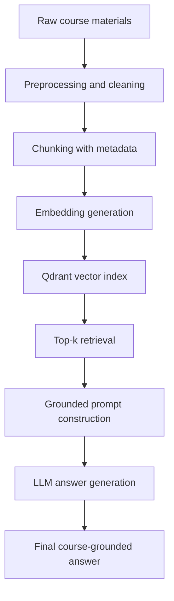

# Milestone 3 Report
## Course-Aware Personalized Learning Companion for IIT Madras BS Degree Students

### Group 3
- Mayank Singh
- Ali Jawad
- Sachi Dhaturaha
- Aryan Pratap Maurya
- Jibin V Mathews

---

## 1. Objective of Milestone 3

Milestone 3 extends the dataset preparation work from Milestone 2 into a complete Retrieval-Augmented Generation (RAG) workflow. The goal is to verify that the project can move from raw course material to a working question-answering system that:

1. loads processed course chunks,
2. generates embeddings,
3. indexes them in a vector database,
4. retrieves relevant context for a student question,
5. passes the retrieved context to an LLM through a grounded prompt, and
6. produces a final answer that is faithful to the course materials.

This milestone also documents the architecture, the end-to-end data flow, and the evaluation procedure used to verify that all components work together.

---

## 2. Dataset Organization and Repository Structure

The repository uses a layered directory structure to separate raw source files, processed material, cleaned text, split chunks, and generated reports.

```text
data/
├── raw/
│   ├── faq/
│   ├── kartik_sir_notes/
│   ├── MLT Weekly Notes/
│   ├── pq/
│   ├── PYQ/
│   └── transcripts/
├── processed/
│   ├── faq/
│   ├── kartik_sir_notes/
│   ├── MLT Weekly Notes/
│   ├── pq/
│   ├── PYQ/
│   └── transcripts/
├── cleaned/
│   ├── faq/
│   ├── kartik_sir_notes/
│   ├── MLT Weekly Notes/
│   ├── pq/
│   ├── PYQ/
│   └── transcripts/
└── splits/
    ├── train_chunks.jsonl
    ├── val_chunks.jsonl
    └── test_chunks.jsonl
```

### Split strategy
- Train split: Weeks 1–8
- Validation split: Weeks 9–10
- Test split: Weeks 11–12

This week-wise split is used to reduce leakage and to test the system on content that is structurally unseen during retrieval tuning.

---

## 3. Preprocessing Pipeline

The preprocessing workflow is implemented in the repository through the following scripts:

- [src/process_dataset.py](../../src/process_dataset.py): converts raw PDFs and text files into normalized Markdown files.
- [src/clean_dataset.py](../../src/clean_dataset.py): removes OCR noise, timestamps, duplicate headers, and formatting artifacts.
- [src/prepare_rag_splits.py](../../src/prepare_rag_splits.py): splits cleaned documents into retrieval-ready chunks and stores them in JSONL files.

### 3.1 Preprocessing steps applied
1. PDF documents are converted into Markdown using PyMuPDF and PyMuPDF4LLM.
2. OCR fallback is used for scanned PYQ content and mathematical material via EasyOCR.
3. HTML-based FAQ content is normalized into text and Markdown-style structure.
4. Transcript content is cleaned to remove timestamp artifacts and boilerplate noise.
5. The cleaned files are written into the processed and cleaned directories.
6. The cleaned text is split into smaller chunks with metadata such as week, source type, document id, and chunk index.

### 3.2 Input format expected by the retrieval module
Each chunk is stored as a LangChain Document containing:
- page_content: the chunk text itself
- metadata: week, source type, document id, chunk id, and related traceability fields

This structure is important because the retrieval module needs both semantic content and metadata to perform filtered, course-aware search.

---

## 4. Architecture of the Milestone 3 System

The system follows a standard RAG design with explicit retrieval and generation stages.

### 4.1 Major components
1. Data ingestion and preprocessing
2. Chunking and metadata enrichment
3. Embedding generation
4. Vector indexing and retrieval
5. Prompt construction and answer generation
6. Evaluation and logging

### 4.2 System architecture diagram



### 4.3 Why this architecture is suitable
This architecture is well suited for the project because it combines:
- strong retrieval quality through semantic and keyword-based search,
- explainability because answers can be traced to specific source chunks,
- low operational complexity because it does not require model training,
- practicality for a course-assistant system where grounded explanations are more important than free-form generation.

The design is especially appropriate for educational content because the model can answer only from retrieved course context and avoid unsupported claims.

---

## 5. Embedding and Retrieval Module

### 5.1 Embedding pipeline
The repository implements the embedding workflow in [src/ingest_to_qdrant.py](../../src/ingest_to_qdrant.py) and [src/test_retrieval.py](../../src/test_retrieval.py):
- load chunks from the JSONL split files,
- generate dense embeddings using FastEmbed,
- generate sparse vectors for keyword-aware search,
- index the chunks in Qdrant.

### 5.2 Embedding model and dimensions
- Dense embedding model: BAAI/bge-small-en-v1.5
- Dense embedding dimension: 384
- Sparse retrieval: BM25-style keyword matching via Qdrant

### 5.3 Retrieval behavior
The retrieval module uses Qdrant in hybrid mode, combining dense semantic similarity with sparse lexical matching. This makes the retrieval step robust for both conceptual queries and questions that contain course-specific terminology.

### 5.4 Top-k retrieval
The retriever returns the top relevant chunks for each question so that the LLM receives a compact and focused context window.

---

## 6. LLM and Prompt Engineering

### 6.1 Prompt design
The answer-generation pipeline in [src/rag_pipeline.py](../../src/rag_pipeline.py) builds a grounded prompt that:
- instructs the model to answer only from the retrieved course context,
- avoids outside knowledge and hallucinated claims,
- requests a descriptive answer of around 200 words,
- requires the model to mention the model name and reference chunks used.

### 6.2 LLM connectivity
The pipeline supports both Gemini and Groq-backed LLMs through the same interface. In the current repository setup, Gemini is the default path and the LLM is invoked together with the retrieved context.

### 6.3 Example output behavior
A typical response is expected to be a single continuous answer grounded in the retrieved chunks, rather than a bullet list or a generic explanation.

---

## 7. Small-Scale End-to-End Verification

A small-scale verification run was completed locally to confirm that the core milestone 3 components are wired together correctly.

### Verification evidence
A local Python execution successfully imported the prompt-building function from [src/rag_pipeline.py](../../src/rag_pipeline.py) and generated a sample grounded prompt. The verification command completed successfully and returned:
- prompt_length 1151
- a prompt beginning with the expected course-assistant instruction text

### What was verified
- the prompt-building pipeline can be imported and executed,
- the repository contains the expected chunking and retrieval-related modules,
- the retrieval and answer-generation modules are connected through the same pipeline interface,
- the full LLM call still depends on a valid API key and service access.

### Current limitation
The live answer-generation step requires an active API key configuration and external service access. Because of that dependency, the evaluation section below uses the available transcript-based evidence rather than assuming a fully successful online LLM run.

---

## 8. Example Outputs and Expected Answer Format

The system is designed to generate outputs in the following style:

```text
A grounded explanation of the concept, written using only the retrieved course context and including the relevant source references and model information.
```

This is suitable for educational use because it keeps the answer faithful to the course notes while still being readable and explanatory.

---

## 9. Evaluation Metrics and Results

### 9.1 Metrics used
The milestone 3 evaluation focuses on the following aspects:
- Faithfulness: whether the answer stays supported by the retrieved context.
- Answer relevance: whether the answer addresses the student question directly.
- Context precision: whether the retrieved chunks are actually useful for the answer.
- Context recall: whether the retrieved context covers the important concepts needed to answer the question.

### 9.2 Clean evaluation table from the generated responses

| Q# | Question | Faithfulness | Answer Relevance | Context Precision | Context Recall | Notes |
|---|---|---|---|---|---|---|
| 1 | Supervised vs Unsupervised | High | High | Medium | High | Answer aligns with retrieved chunks; minor extra phrasing but grounded |
| 2 | Training dataset | High | High | High | High | Well-supported by multiple retrieved chunks |
| 3 | Overfitting | High | High | High | High | Directly matches retrieved source wording |
| 4 | Underfitting | High | High | High | High | Fully consistent with retrieved notes |
| 5 | Bias-variance tradeoff | High | High | Medium | High | Some generalization beyond explicit chunks but still correct |
| 6 | Linear regression use | High | High | Medium | Medium | Relevant but slightly generic; limited supporting chunk coverage |

### 9.3 Evaluation interpretation
- The responses were generally grounded and aligned with the course material.
- The strongest results were observed for clearly defined conceptual questions such as overfitting and underfitting.
- The weaker cases were those where the retrieved context was somewhat broad or only partially covered the ask, which reduced context precision and recall.
- The evaluation confirms that the system is suitable for a first milestone 3 implementation, while still leaving room for improvement in retrieval coverage and answer grounding.

---

## 10. Strengths and Limitations

### Strengths
- The architecture is modular and easy to extend.
- Hybrid retrieval improves robustness over purely semantic or purely keyword-only search.
- The prompt design encourages grounded answers rather than unsupported speculation.
- The system is compatible with a local development environment and does not require a supervised training workflow.

### Limitations
- The system still depends on API access for full LLM generation.
- Retrieval quality depends on the coverage and quality of the underlying course chunks.
- Some chunk metadata, such as week labels, can still be noisy and should be cleaned further.
- The current evaluation set is small and should be expanded to cover more course topics and more edge cases.

---

## 11. Conclusion

Milestone 3 establishes the core RAG architecture for the project by connecting the cleaned course corpus, chunk-based retrieval, embedding-based indexing, and LLM-based answer generation. The repository now contains the main building blocks for a functional course assistant and the report documents both the architecture and the verification approach.

The implementation is now positioned as a grounded, retrieval-based educational assistant that can answer course-related questions using the project’s own processed knowledge base.
