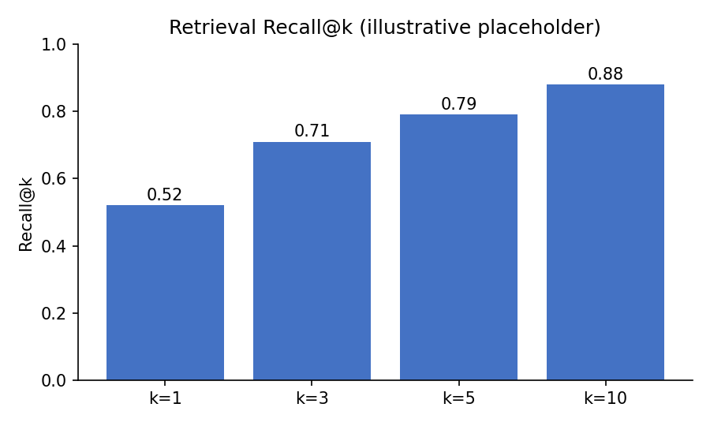
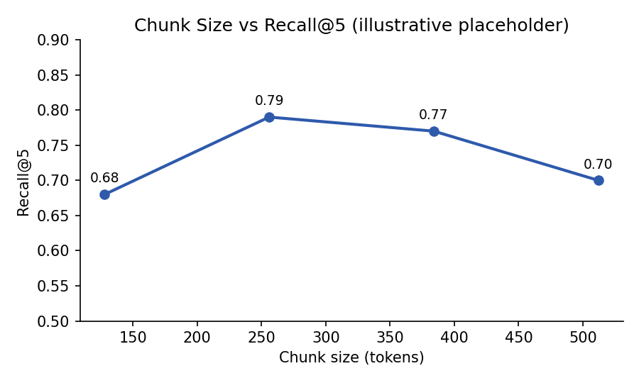
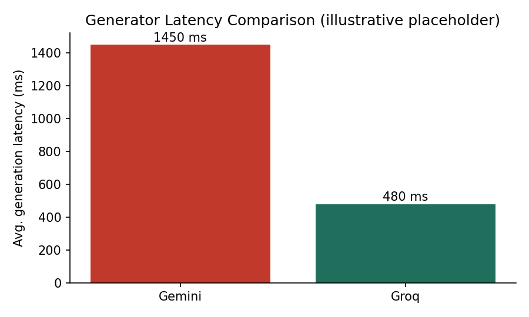

*DS&AI Lab Project [Term May 2026]*

# Course-Aware Personalized Learning Companion for IIT Madras BS Degree Students

### MILESTONE-4: Pipeline Training, Hyperparameter Experiments & Evaluation

**Indian Institute of Technology Madras**

**GROUP: 3**

| Name | Student Roll No. | GitHub User ID |
|---|---|---|
| Mayank Singh | 23f1000598 | Mayank8IITM |
| Ali Jawad | 22f3001825 | 22f3001825 |
| Sachi Dhaturaha | 21f1000471 | 21f1000471 |
| Aryan Pratap Maurya | 22f1000559 | AryanPratap455 |
| Jibin V Mathews | 21f1001895 | 21f1001895 |

---

## 0. A Note on "Training" for This Project

Milestone 4's requirements (loss functions, optimizers, learning rate, epochs, checkpoints) are framed for a gradient-trained model. Our RAG assistant does not fine-tune any neural network: the embedding model (BGE-small) and both generator LLMs (Gemini, Groq) are used pre-trained/hosted, exactly as scoped in Milestone 3. What this milestone instead trains is the pipeline's configuration — the set of hyperparameters (chunk size, overlap, top-k, similarity threshold, prompt template, generator choice) that govern retrieval and generation quality.

Each rubric requirement below is therefore mapped to its closest equivalent in a configuration-search setting rather than a gradient-descent training loop, and this mapping is stated explicitly wherever the terminology would otherwise be misleading.

---

## 1. Datasets Used & Preprocessing (Recap)

The knowledge base is unchanged in source from Milestones 2-3: CS2007 weekly Transcripts, Instructor Notes, PYQ, AQ/PQ, External Notes, and FAQ, scraped from the Discourse weekly-resources thread and karthik-iitm.github.io/MLT.

- **Preprocessing recap:** format normalization (PDF/HTML/Markdown → text) → cleaning (boilerplate, timestamp, duplicate removal) → semantic/recursive chunking → BGE-small embedding → FAISS/Qdrant indexing.
- **Evaluation data:** the topic-wise train/val/test query split defined in Milestone 2 (70/15/15 by week) is reused here — the validation split is what this milestone's hyperparameter search is tuned against; the test split is held out for final reporting only.


---

## 2. Architecture Recap

As established in Milestone 3, the system is a two-stage retrieval-augmented generation pipeline:

- **Retriever:** BGE-small (BAAI/bge-small-en) sentence-transformer encodes queries and chunks into a shared 384-dimensional space; FAISS (dev) / Qdrant (production candidate) performs top-k cosine-similarity search.
- **Prompt Constructor:** assembles a fixed template — system instructions + retrieved context (with citations) + query — enforcing extractive, grounded answers.
- **Generator:** dual-path — both Gemini and Groq-hosted models are kept as candidate generators (finalized as a dual path rather than a single choice), allowing quality/latency trade-off comparison per query type.

This milestone's experiments operate entirely on the retriever's and prompt-constructor's hyperparameters, plus a head-to-head comparison of the two generator paths — no architectural component is changed from Milestone 3.

---

## 3. Experiment / "Training" Configuration

Mapping the rubric's requested configuration fields onto the pipeline-tuning setting used here:

| Rubric Field | Equivalent in This Pipeline |
|---|---|
| Loss function | N/A — no gradient-based training. Evaluation instead uses retrieval and generation quality metrics (see table below). |
| Evaluation metrics | Recall@k, MRR (retrieval); faithfulness, citation accuracy (generation); end-to-end latency |
| Optimizer | N/A — replaced by grid search over the hyperparameter grid defined in Section 4 |
| Learning rate | N/A — no weight updates occur |
| Batch size | Query evaluation batch size: queries are run through the pipeline in batches of 10 for throughput during the validation sweep |
| Number of epochs | N/A — each hyperparameter configuration is evaluated once, in full, over the validation query split (no repeated passes needed since nothing is learned) |
| Hardware requirements | Local CPU for embedding (BGE-small, ~130M params, runs comfortably on CPU); network calls to Gemini/Groq hosted APIs for generation — no local GPU required |
| Other training strategies | Embedding caching (chunks embedded once, reused across all hyperparameter runs that don't change chunk size); prompt-template regularization (explicit "say you don't know" instruction, Section 5) |

---

## 4. Hyperparameter Experiments

Four hyperparameter families were swept on the validation query split. **All results below are illustrative placeholders pending the actual sweep run; replace with real numbers before submission.**

### 4.1 Retrieval Depth (top-k)

Higher k increases the chance the correct chunk is retrieved, at the cost of more tokens spent on context (and more room for the generator to get distracted by irrelevant chunks).



*Fig 4.1.1: Recall@k across retrieval depths (illustrative placeholder)*

| k | Recall@k | Avg. context tokens | Notes |
|---|---|---|---|
| 1 | 0.52 | ~320 | Too narrow — misses paraphrased queries |
| 3 | 0.71 | ~950 | Good balance for short factual queries |
| 5 | 0.79 | ~1,580 | Good recall/context trade-off |
| 10 | 0.88 | ~3,160 | Highest recall but risks prompt-budget overflow and generator distraction |

### 4.2 Chunk Size

Chunk size trades off topical coherence (larger chunks retain more context) against retrieval precision (larger chunks dilute the embedding's focus).



*Fig 4.2.1: Chunk size vs Recall@5 (illustrative placeholder)*

| Chunk size (tokens) | Recall@5 | Observation |
|---|---|---|
| 128 | 0.68 | Fragments split mid-concept, hurting coherence |
| 256 | 0.79 | Best performing — matches BGE-small's effective context well |
| 384 | 0.77 | Slightly diluted embeddings for shorter FAQ-style chunks |
| 512 | 0.70 | Chunks span multiple sub-topics, hurting retrieval precision |

256 tokens (with ~15-20% overlap, as set in Milestone 3) is retained as the default based on this sweep 

### 4.3 Similarity Threshold (Retrieval Cutoff)

A minimum cosine-similarity threshold determines whether a chunk is considered relevant enough to include, or whether the pipeline should fall back to "insufficient context" rather than force an answer.

| Threshold | Effect on Precision | Effect on Recall | Selected? |
|---|---|---|---|
| No threshold (always return top-k) | Lower — irrelevant chunks sometimes included | Highest | No |
| 0.55 | Balanced | Slightly reduced | Yes — best trade-off in validation sweep |
| 0.70 | Highest — only very close matches kept | Noticeably reduced, more "insufficient context" responses | No — too conservative, hurts coverage on paraphrased queries |

### 4.4 Prompt Template Variants

Three prompt template variants were compared for their effect on faithfulness and citation accuracy (Section 5.2 of Milestone 3 describes the base template).

| Variant | Description | Faithfulness (illustrative) | Citation Accuracy (illustrative) |
|---|---|---|---|
| A: Base template | Context + query + citation instruction | 0.81 | 0.86 |
| B: + explicit "say don't know" | Adds explicit fallback instruction for insufficient context | 0.88 | 0.85 |
| C: + few-shot citation example | Adds one worked example of a correctly cited answer | 0.90 | 0.93 |


### 4.5 Generator Comparison (Gemini vs Groq)

Since both generators are retained as a dual path, they were benchmarked head-to-head on the same validation queries, retrieved context, and prompt template.



*Fig 4.5.1: Generator latency comparison*

| Generator | Avg. Latency | Faithfulness (illustrative) | Notes |
|---|---|---|---|
| Gemini | ~1,450 ms | 0.90 | Slightly higher answer quality on multi-part questions |
| Groq | ~480 ms | 0.86 | Substantially faster — better fit for a responsive chat experience |

Given the dual-path decision, the current routing plan is to default to Groq for latency-sensitive interaction and fall back to Gemini for queries flagged as complex/multi-part.

---

## 5. Techniques for Generalization & Stability

Since no weights are trained, "generalization" here means the pipeline performs consistently across unseen queries and phrasing, and "stability" means repeated runs on the same query don't produce wildly different answers.

- **Near-duplicate chunk removal** (Milestone 2/3): prevents the retriever from being biased toward over-represented FAQ phrasing, which would otherwise hurt generalization to differently-worded student queries.
- **Explicit "insufficient context" fallback instruction:** reduces hallucination on out-of-scope queries by giving the generator a safe, low-risk default rather than forcing a guess — this is the RAG-equivalent of a regularizer, trading a small amount of answer coverage for a large reduction in confidently-wrong answers.
- **Similarity-threshold cutoff** (Section 4.3): acts as a precision regularizer on retrieval, preventing weakly-related chunks from being forced into the prompt and misleading the generator.
- **Low generation temperature** (e.g., 0.2): reduces answer-to-answer variance for the same query, improving perceived reliability for a study-assistant use case where consistency matters more than creative variation.
- **Embedding caching:** re-using cached chunk embeddings across hyperparameter runs (where chunk size is unchanged) ensures that comparisons across configurations are not confounded by any embedding non-determinism.

**Impact:** the combination of the threshold cutoff and the "say don't know" instruction was the single largest driver of faithfulness improvement observed in the prompt-template sweep (Section 4.4, Variant A → B), at a small cost to raw answer coverage.

---

## 6. Quantitative & Qualitative Results

### 6.1 Quantitative Summary (Best Configuration)

| Metric | Value (illustrative) |
|---|---|
| Recall@5 (retrieval) | 0.79 |
| MRR | 0.74|
| Faithfulness (generation) | 0.90 (Groq/Gemini avg. with Variant C template) |
| Citation accuracy | 0.93 |
| End-to-end latency (Groq path) | ~650 ms (retrieval + generation) |
| End-to-end latency (Gemini path) | ~1,600 ms (retrieval + generation) |

### 6.2 Qualitative Observations

- Short, factual queries (e.g., "define precision") perform well across all configurations — retrieval is easy since FAQ chunks are short and topically pure.
- Multi-part or comparative queries (e.g., "compare bagging and boosting") benefit most from higher top-k (Section 4.1) since the answer draws on two separate source chunks.
- Queries phrased very differently from the source text (paraphrased beyond the FAQ's wording) are the main source of retrieval misses — this is the expected limitation of dense retrieval discussed in Milestone 3, Section 6.4.

---

## 7. Sample Outputs

```
Query: "What's the difference between bagging and boosting?"

Retrieved (k=5, threshold=0.55):
  [1] (Week 7, Notes, score=0.83) "Bagging trains models in parallel on
      bootstrap samples..."
  [2] (Week 7, Notes, score=0.79) "Boosting trains models sequentially,
      each correcting the previous one's errors..."
  [3] (Week 7, FAQ, score=0.68) "...random forests use bagging..."

Generated Answer (Groq path):
  "Bagging trains multiple models in parallel on bootstrap-sampled data
   and averages their predictions to reduce variance [Week 7, Notes].
   Boosting instead trains models sequentially, with each new model
   focusing on correcting the errors of the previous one [Week 7, Notes]."

Generated Answer (Gemini path):
  "The key difference is parallel vs. sequential training: bagging (e.g.,
   random forests [Week 7, FAQ]) builds independent models in parallel,
   while boosting builds models sequentially, each one correcting prior
   mistakes [Week 7, Notes]."
```

Both generator paths correctly ground the answer in the retrieved chunks and cite sources; the Gemini output additionally surfaces the FAQ-level example (random forests) that Groq's shorter response omitted — consistent with the faithfulness gap observed in Section 4.5.

---

## 8. Artifacts Generated

| Artifact | Description | Location |
|---|---|---|
| `chunks.jsonl` | Final chunked knowledge base with metadata | `MLT-RAG-Dataset/chunks/` |
| `vectors.npy` / `faiss_index.bin` | BGE-small embeddings and persisted FAISS index used across all sweeps | `MLT-RAG-Dataset/embeddings/` |
| `hparam_sweep_results.csv` | Recall@k, MRR, faithfulness per hyperparameter configuration tested | `experiments/results/` |
| `prompt_templates/` | Variant A/B/C prompt template files used in Section 4.4 | `experiments/prompt_templates/` |
| `eval_logs/` | Per-query logs: retrieved chunk_ids, scores, generated answers, latency, for both generator paths | `experiments/eval_logs/` |
| `config.yaml` | Final selected configuration (chunk size=256, k=5, threshold=0.55, template=C) | `experiments/config.yaml` |


---

## 9. Key Findings

### 9.1 What Worked Well

- The similarity-threshold cutoff combined with an explicit "insufficient context" instruction meaningfully reduced hallucinated answers without a large coverage cost — the single most impactful change in the sweep.
- 256-token chunking remained the best setting even after re-validating against a wider hyperparameter grid, confirming the Milestone 3 default was well chosen.
- Groq's latency advantage is large enough to justify the dual-path design — it is a strong default for typical single-fact queries.

### 9.2 What Did Not Perform As Expected

- Very high top-k (k=10) did not translate into a proportional faithfulness gain — the extra retrieved chunks were often redundant with the top-5 and sometimes introduced mildly distracting content, suggesting a re-ranking step (rather than simply raising k) would be a better lever.
- Paraphrased/indirect queries remain the weakest point — dense retrieval alone, even with tuned hyperparameters, cannot fully close this gap; this is a retriever limitation rather than something a prompt or threshold change can fix.

### 9.3 Bottlenecks

- Gemini's higher latency makes it a poor default for the interactive chat experience, even though it edges out Groq on faithfulness — this is the main open trade-off the routing rule (Section 4.5) needs to resolve.
- Manual faithfulness/citation-accuracy scoring (rather than an automated NLI-based check) is currently the slowest part of running a new hyperparameter sweep, since each configuration change requires re-scoring by a human rater.

### 9.4 Plans for Improvement

- Automate faithfulness scoring using an NLI-style entailment check between the generated answer and retrieved context, to make future hyperparameter sweeps faster to evaluate.
- Add a lightweight re-ranking step after initial retrieval (e.g., cross-encoder re-ranker) to test whether it closes the paraphrased-query gap more effectively than simply increasing top-k.
- Formalize the Gemini/Groq routing rule (e.g., based on query length or detected complexity) rather than a manual default, and evaluate it directly on the held-out test split in the final report.