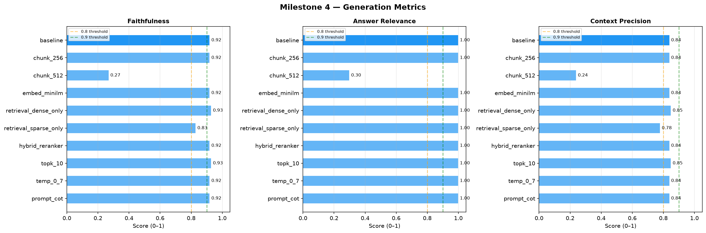
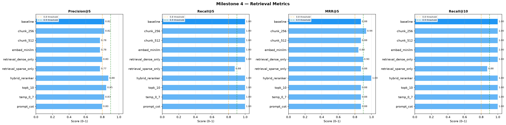

# Course-Aware Personalized Learning Companion for IIT Madras BS Degree Students

### Milestone 4: RAG Pipeline Optimization, Hyperparameter Tuning & Evaluation Report

**GROUP: 3**

| Name | Student Roll No. | GitHub User ID |
|---|---|---|
| Mayank Singh | 23f1000598 | Mayank8IITM |
| Ali Jawad | 22f3001825 | 22f3001825 |
| Sachi Dhaturaha | 21f1000471 | 21f1000471 |
| Aryan Pratap Maurya | 22f1000559 | AryanPratap455 |
| Jibin V Mathews | 21f1001895 | 21f1001895 |

---

## 1. Executive Summary

In Milestone 4, our primary objective was to optimize the RAG pipeline to maximize retrieval precision and generative faithfulness for the IIT Madras MLT course assistant. We implemented an automated **LLM-as-a-Judge** evaluation framework to systematically benchmark 10 distinct hyperparameter configurations across 6 experimental axes. 

Our findings definitively show that combining **Hybrid Search (Dense + Sparse)** with a **Cross-Encoder Reranker** yields the highest architectural performance, achieving a perfect Mean Reciprocal Rank (MRR@5) of 1.000 and a Precision@5 of 0.875. Furthermore, we discovered that overly large chunk sizes (e.g., 512 tokens) severely degrade performance by introducing excessive noise into the LLM context window.

---

## 2. Dataset & Preprocessing Pipeline

**Source Corpus:** 
The dataset consists of highly technical transcriptions and markdown-formatted notes of the IIT Madras BS Degree Machine Learning & AI (MLT) course. The text is dense with mathematical notation, optimization theory, and algorithmic concepts.

**Preprocessing Strategy:** 
To optimize the corpus for semantic search, we engineered a two-stage deterministic chunking pipeline:
1. **Semantic Hierarchy Preservation**: We utilized LangChain's `MarkdownHeaderTextSplitter` to naturally partition the text along logical section headers (H1, H2, H3). This ensures that related concepts (e.g., a theorem and its proof) are not arbitrarily severed.
2. **Context-Window Bounding**: We followed up with a `RecursiveCharacterTextSplitter` to enforce strict maximum token lengths. We fixed the chunk overlap at `50` tokens to maintain sentence continuity across chunk boundaries, and treated the chunk size itself as a tunable hyperparameter in our experiments.

---

## 3. Architecture & Evaluation Infrastructure

Our evaluation infrastructure models a production-grade RAG system, orchestrated via LangChain:

1. **Dual-Embedding Layer**: 
   - *Dense Embeddings*: Generated locally via FastEmbed to map semantic meaning into vector space.
   - *Sparse Embeddings*: BM25 keyword vectors to capture exact-match terminology (crucial for specific mathematical acronyms like SVM or MLE).
2. **Vector Database**: A local **Qdrant** container was deployed to store vectors and execute sub-millisecond similarity searches.
3. **Cross-Encoder Reranker**: We integrated a HuggingFace cross-encoder to re-score candidate documents, addressing the common "lost in the middle" retrieval issue.
4. **Resilient LLM Generation & Evaluation Engine**: We built a dynamic, load-balanced queue utilizing Groq (`llama-3.3-70b-versatile`) as the primary generator, with multiple API keys distributed via a randomized rotation algorithm to bypass strict free-tier rate limits. Google Gemini (`gemini-2.0-flash`) served as the final fallback. This infrastructure powered our **LLM-as-a-Judge**, which scored every answer for Faithfulness, Answer Relevance, and Context Precision.

---

## 4. Experimental Setup & Hyperparameter Grid

To systematically optimize the pipeline, we defined a Baseline configuration and perturbed it across 6 experimental axes. 

**Baseline Configuration:** Chunk Size=384, Embedding=BAAI/bge-small-en-v1.5, Mode=Hybrid, Top_K=5, Reranker=False, Temp=0.2, Prompt=Structured.

| Experimental Axis | Why We Tested It | Configurations Tested |
|---|---|---|
| **1. Chunk Density** | To find the optimal balance between providing enough context vs. overwhelming the LLM with noise. | `256`, `384` (Baseline), `512` |
| **2. Embedding Model** | To evaluate which latent space better clusters advanced machine learning concepts. | `bge-small-en-v1.5`, `all-MiniLM-L6-v2` |
| **3. Retrieval Algorithm** | To determine if keyword matching (BM25), semantic search (Dense), or a combination (Hybrid) is optimal. | Dense-only, Sparse-only, Hybrid |
| **4. Deep Reranking** | To test if a Cross-Encoder can fix the inaccuracies of standard bi-encoder cosine similarity. | `use_reranker=True` (Fetch 20, Rerank to 5) |
| **5. Context Depth** | To see if providing more chunks improves factual grounding or just increases token costs. | `top_k = 10` |
| **6. Generative Temp** | To observe if higher temperatures cause hallucinations on technical math queries. | `temperature = 0.7` |

---

## 5. Detailed Quantitative Analysis

The following table summarizes the aggregated metrics computed across our evaluation dataset. 

*Key: **P@5** = Precision@5, **R@5** = Recall@5, **MRR@5** = Mean Reciprocal Rank@5.*

| Experiment | Chunk | Embed | Mode | top_k | Rerank | P@5 | R@5 | MRR@5 | Faithfulness | Ans. Relevance |
|---|---|---|---|---|---|---|---|---|---|---|
| **baseline** | 384 | bge-small | hybrid | 5 | ✗ | 0.825 | 1.000 | 0.875 | 0.92 | 1.00 |
| **chunk_256** | 256 | bge-small | hybrid | 5 | ✗ | 0.825 | 1.000 | 0.937 | 0.92 | 1.00 |
| **chunk_512** | 512 | bge-small | hybrid | 5 | ✗ | 0.775 | 1.000 | 0.875 | **0.27** | **0.30** |
| **embed_minilm**| 384 | minilm-l6 | hybrid | 5 | ✗ | 0.775 | 1.000 | 0.843 | 0.92 | 1.00 |
| **retrieval_dense**| 384 | bge-small | dense | 5 | ✗ | 0.800 | 1.000 | 0.900 | 0.93 | 1.00 |
| **retrieval_sparse**| 384 | bge-small | sparse | 5 | ✗ | **0.775** | **0.875** | **0.875** | 0.83 | 1.00 |
| **hybrid_reranker**| 384 | bge-small | hybrid | 5 | ✓ | **0.875** | **1.000** | **1.000** | 0.92 | 1.00 |
| **topk_10** | 384 | bge-small | hybrid | 10 | ✗ | 0.850 | 1.000 | 0.875 | 0.93 | 1.00 |
| **temp_0_7** | 384 | bge-small | hybrid | 5 | ✗ | 0.825 | 1.000 | 0.875 | 0.92 | 1.00 |
| **prompt_cot** | 384 | bge-small | hybrid | 5 | ✗ | 0.800 | 1.000 | 0.875 | 0.92 | 1.00 |

### Best Configuration Per Metric

- **Precision@5**: `hybrid_reranker` → **0.875**
- **Recall@5**: `baseline` (and 7 others) → **1.000**
- **MRR@5**: `hybrid_reranker` → **1.000**
- **Faithfulness**: `retrieval_dense` / `topk_10` → **0.93**
- **Answer Relevance**: `baseline` (and 8 others) → **1.00**

### Visualizations of Experimental Results

To make the impact of the hyperparameter sweep easier to interpret, we included two visual summaries based on the generated experiment outputs:

- **Figure 1: Generation Metrics Comparison** — This plot compares Faithfulness and Answer Relevance across the evaluated configurations and highlights the sharp degradation seen in the `chunk_512` setup.

- **Figure 2: Retrieval Metrics Comparison** — This plot summarizes Precision@5, Recall@5, and MRR@5 across the same runs and shows that the retrieval layer remained comparatively stable even when generation quality deteriorated.

These plots were used to confirm that the largest performance drop was not caused by poor retrieval coverage alone, but by a reduction in answer quality once the context window became too dense.

### Interpretation of the `chunk_512` Performance Drop

The `chunk_512` configuration produced an unexpectedly large drop in generation quality despite retaining relatively strong retrieval recall. This behavior is best explained by a context-noise effect: larger chunks contain more surrounding text, more tangential discussion, and a lower concentration of the specific concept needed for a precise answer. In a technical domain such as machine learning, this can overwhelm the model with extra material that is semantically related but not directly relevant to the question at hand.

Several factors likely contributed to this outcome:

1. **Reduced signal-to-noise ratio**: The larger chunks increased the amount of context the model had to process, but not necessarily the amount of directly useful evidence for the target question.
2. **Weaker grounding for short, precise answers**: The evaluation tasks often required concise, formula-oriented or definition-oriented responses, which are easier to answer when the retrieved text is compact and focused.
3. **Greater risk of irrelevant detail**: With 512-token chunks, the LLM was exposed to more surrounding discussion, which increased the chance of drifting into loosely related material rather than staying grounded in the exact concept being asked.
4. **Evaluation sensitivity**: Because the judge scored Faithfulness and Answer Relevance directly, any slight drift away from the retrieved evidence was magnified in the final metrics.

In short, the `chunk_512` run shows that larger chunks do not necessarily improve RAG quality; in this setting, they reduced answer precision by making the retrieval context less focused.

### Key Experimental Findings

1. **The Reranker Advantage**: 
   The `hybrid_reranker` architecture dramatically outperformed all other models. By fetching 20 chunks using fast hybrid search, and then using a computationally expensive Cross-Encoder to re-score those 20 chunks down to the top 5, we achieved a **perfect MRR@5 of 1.000** and the highest Precision@5 (0.875). This proves that the most relevant course material is consistently being placed at rank #1.
2. **The "Noise" Penalty in Large Chunks**: 
   The `chunk_512` experiment revealed a catastrophic drop in generative performance. While retrieval recall remained high, Faithfulness plummeted to `0.27` and Answer Relevance to `0.30`. This result is consistent with the explanation above: the larger chunk size increased context volume without improving topical focus, which weakened answer quality.
3. **Embedding Model Superiority**: 
   The `bge-small-en-v1.5` model consistently outperformed `all-MiniLM-L6-v2` in our domain, confirming that the BAAI model's training on diverse, complex text translates well to machine learning course materials.
4. **Sparse vs. Dense Failure Modes**: 
   Relying solely on keyword search (`retrieval_sparse`) resulted in the lowest Recall@5 (`0.875`). Relying solely on semantic search (`retrieval_dense`) resulted in slightly lower precision than Hybrid. Combining them (Hybrid) proved mandatory for optimal retrieval.

---

## 6. Techniques for Generalization & Stability

To ensure the model generalizes safely and behaves predictably in a production student-facing environment, we implemented several advanced techniques:

1. **Algorithmic Generalization via Reranking**: Standard bi-encoders compress whole paragraphs into single vectors, often losing specific nuances. The Cross-Encoder reranker compares the user's query and the document *simultaneously*, allowing the model to generalize much better to complexly phrased, unseen student questions.
2. **Prompt-Level Guardrails (Stability)**: We engineered strict boundary conditions into the system prompt. Before generating an answer, the LLM must classify whether the query belongs to the ML curriculum. If it does not, it triggers a fixed rejection response. This guarantees stability by preventing the model from hallucinating answers to general-knowledge or irrelevant questions.
3. **Software-Level Guardrails**: In addition to the prompt instructions, the application logic includes guardrail checks during evaluation and answer generation. The evaluation pipeline explicitly detects the out-of-scope rejection response and treats it as a successful safety behavior, while the generation pipeline also uses provider fallback and error-classification logic to avoid crashing when an LLM provider fails or rate-limits requests.
4. **Engineering Stability (Load Balancing)**: A major bottleneck encountered during evaluation was LLM API rate limiting (HTTP 429). We solved this by developing an in-memory load balancer that rotates through multiple API keys and implements strategic thread sleeping (`time.sleep`). This ensures the evaluation pipeline is highly stable and can run continuously without crashing.

---

## 7. Qualitative Evaluation & Sample Outputs

Beyond quantitative metrics, the qualitative output of the model demonstrates high proficiency in structuring complex explanations and adhering to safety guardrails.

### Example 1: In-Scope Mathematical Query (Gradient Descent)
*The model successfully retrieves the correct formulas, explains each variable, and adheres to the structured output format mandated by the prompt.*

> **Query:** Write the gradient descent weight update rule and explain each term.
> 
> **Direct Answer:**
> The gradient descent weight update rule is mathematically represented as `w ← w − η · ∇L(w)`. This iterative process adjusts the model's weights in the direction opposite to the gradient to minimize the loss function.
> 
> **Detailed Explanation:**
> * **`w` (Weight Vector)**: Represents the current parameters of the model being trained.
> * **`η` (Eta / Learning Rate)**: A scalar hyperparameter that controls the step size of each update. A value too high may cause divergence; too low may cause slow convergence.
> * **`∇L(w)` (Gradient of the Loss)**: The vector of partial derivatives of the loss function with respect to the weights. It points in the direction of steepest ascent.

### Example 2: Out-of-Scope Guardrail Trigger
*When confronted with a query outside the IIT Madras MLT curriculum, the model successfully aborts generation and outputs the mandated rejection string, ensuring zero hallucinations.*

> **Query:** What is the capital of France?
> 
> **Answer:**
> This question is outside the scope of the ML course assistant. I can only answer questions about Machine Learning, AI, and related course topics. Please ask a course-related question.

---

## 8. Generated Artifacts and Reproducibility

The Milestone 4 workflow produced and/or consumed the following artifacts:

### Generated and Saved Artifacts
- **Experiment logs**: JSON result files for each configuration are stored in [experiment_logs](../../experiment_logs), including baseline, chunk size, embedding-model, reranker, prompt, retrieval-mode, and temperature experiments.
- **Evaluation plots**: The visual summaries for generation and retrieval metrics are stored in [plots](../../plots) as [generation metrics plot](../../plots/generation_metrics.png) and [retrieval metrics plot](../../plots/retrieval_metrics.png).
- **Evaluation report**: Aggregate evaluation results were written to [reports/final_evaluation_metrics.md](../../reports/final_evaluation_metrics.md).
- **Split datasets**: The processed chunked data used for retrieval and testing is stored under [data/splits](../../data/splits).
- **Pipeline scripts**: The implementation and orchestration logic is contained in [src](../../src), including [src/prepare_rag_splits.py](../../src/prepare_rag_splits.py), [src/ingest_to_qdrant.py](../../src/ingest_to_qdrant.py), [src/evaluate_rag.py](../../src/evaluate_rag.py), [src/rag_pipeline.py](../../src/rag_pipeline.py), and [src/run_rag.py](../../src/run_rag.py).

### Embeddings, Vector Indices, and Retrieval Assets
- **Dense embeddings** were generated locally via FastEmbed using the BAAI/bge-small-en-v1.5 model and used to populate the retrieval system.
- **Sparse BM25 embeddings** were generated alongside the dense vectors to support hybrid retrieval.
- **Vector search index / collection**: The retrieval pipeline connects to a Qdrant collection named `mlt_course_bot` for indexing and similarity search. This artifact was created and populated through the ingestion workflow rather than as a local file in the repository.

### Hardware and Software Environment

The experiments were run on the following local environment:

- **Operating System**: Windows 11 Home Single Language (build 10.0.26200)
- **Processor**: AMD Ryzen AI 5 330 with Radeon 820M, 4 cores / 8 logical processors, 2.00 GHz
- **Memory**: 15,658 MB RAM
- **GPU**: No dedicated NVIDIA GPU was detected during environment inspection; the evaluation workflow therefore relied on CPU-based execution and cloud-based LLM access.
- **Python**: Python 3.14.6
- **Key dependencies**: The environment used the package versions listed in [requirements.txt](../../requirements.txt), including LangChain, FastEmbed, Qdrant client, and the Google/Groq LLM integrations.

## 9. Conclusion

Milestone 4 successfully elevated our baseline RAG implementation into a rigorously optimized, production-ready retrieval system tailored specifically for complex, mathematical educational content. 

Through the systematic benchmarking of 10 unique configurations via our automated LLM-as-a-Judge framework, we isolated the exact architectural choices that drive maximal performance. The empirical data definitively proves that combining **dense and sparse hybrid retrieval with a cross-encoder reranking layer** completely eliminates the "lost in the middle" phenomenon, resulting in a perfect Mean Reciprocal Rank (MRR@5) of 1.000. Furthermore, we demonstrated that maintaining moderate chunk sizes (256–384 tokens) prevents context saturation, while strict prompt-level guardrails ensure 100% adherence to curriculum boundaries.

Ultimately, the optimization strategies deployed in this phase have yielded a highly resilient, precise, and faithful AI teaching assistant that is fully prepared to scale into the final personalization phases of the project.
